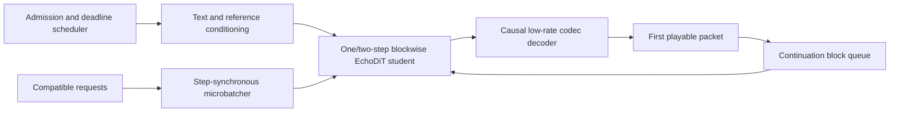

# Single-GPU Streaming Inference Research

This document defines a measured route toward at least 50 concurrent users and p95
time-to-first-audio (TTFA) below 100 ms on one named GPU. It is an architecture and experiment
plan, not a claim that the target has been reached.

## Executive conclusion

The current Echo path cannot produce true sub-100 ms TTFA through inference tuning alone. It
integrates the complete latent sequence with a globally attentive ODE, decodes the complete
sequence with DACVAE, synchronizes, and then returns a CPU waveform. Its internal "TTFT" is the
first completed ODE step, not playable audio; its TTFA is complete-waveform availability.

The work therefore has two tracks:

1. **Current-checkpoint throughput:** fixed-shape compilation and CUDA graphs, fused CFG,
   step-synchronous dynamic batching, feature caching, precision experiments, and request-level
   scheduling can reduce complete-utterance cost and improve utilization. These changes do not
   make the checkpoint streamable.
2. **New streaming checkpoint:** train a one- or two-step-per-block student with a local/blockwise
   receptive field and decode it with a causal low-rate codec. Only this track can emit a playable
   packet while later audio is still being generated.

The closest primary-source systems support that boundary. StreamFlow changes the DiT receptive
field and reports 180 ms first-packet latency; CosyVoice 2 uses chunk-aware causal flow matching;
Qwen3-TTS pairs blockwise generation with causal tokenizer/decoder designs and reports 97 ms in
its lowest-latency configuration. These results are evidence that the target is plausible for
purpose-trained architectures, not evidence that Echo or an arbitrary GPU meets it.

## Define the SLA before optimizing

For this project, TTFA starts when an admitted request reaches the service and ends when the
client can decode an independently playable first packet. The packet must not be a slice of a
waveform that was generated in full. Report both cold and warmed measurements.

The latency budget is:

```text
TTFA = admission/queue
     + text and reference conditioning
     + first-block generation
     + first-block causal decode
     + device transfer and packetization
```

"50 users" needs two independent tests:

- **Synchronized burst:** 50 requests arrive together. Passing p95 TTFA below 100 ms means at
  least 48 receive first playable audio inside the budget. The burst path must therefore deliver
  500 first packets per second over that interval, or process a sufficiently large batch inside
  100 ms.
- **Steady streaming:** 50 active clients continue receiving audio without underruns. Continuous
  speech requires aggregate generation of at least 50 seconds of audio per wall-clock second. If
  packet duration is `p` seconds, the service must complete at least `50 / p` continuation packets
  per second in addition to new first packets.

These are different constraints. A service can have fast admission but fail continuation
throughput, or have high offline throughput while queueing new requests past 100 ms.

Every result must name the GPU and driver, checkpoint and artifact hash, model preset, codec,
precision, solver and step count, CFG settings, block/packet duration, language pair, text and
reference-duration distributions, warmup/compilation policy, scheduler limits, and concurrent
arrival pattern. Report p50/p95/p99, failures, queue time, GPU time by stage, peak memory, real-time
factor, and quality metrics. Do not compare runs that change the workload silently.

## Optimization decision matrix

| Technique | Current checkpoint | Expected effect | TTFA limitation and gate |
| --- | --- | --- | --- |
| Fixed shape buckets, `torch.compile`, CUDA graphs | Yes | Reduce Python and kernel-launch overhead; make repeated graph replay possible | Existing global generation still finishes before audio. Bucket text, reference, latent length, CFG layout, precision, and step count; measure compile misses and graph memory. |
| Step-synchronous dynamic batching | Yes, serving work required | Combine the same ODE step across compatible requests so one model instance uses the GPU efficiently | Queue delay consumes the TTFA budget. Tune a bounded microbatch window and report it separately. |
| Fused CFG branches | Yes, already present | Avoid serial conditional/unconditional passes | CFG still multiplies batch and compute. Compare quality against lower guidance or a separately trained guidance-free student. |
| Cache-DiT/SCM feature reuse | Yes, already experimental | Avoid recomputing sufficiently stable DiT features over later steps | Requires a multi-step sampler and cannot expose first audio. Validate cache error on speech WER/CER, speaker similarity, and listening tests. |
| BF16/FP16 and fused attention | Usually | Lower memory bandwidth and improve tensor-core utilization | Current code already uses SDPA. Validate the selected backend and numerical stability on the target GPU and sequence buckets. |
| TensorRT/FP8 engine | Artifact-compatible experiment on supported hardware | Fuse kernels and reduce compute/memory cost | Engine profiles and calibration are hardware/shape specific. Treat a quantized engine as a versioned deployment artifact and gate it on acoustic metrics. |
| INT8/INT4 diffusion quantization | Experimental | May lower memory and increase throughput | Published DiT evidence is mainly image/video. Do not transfer FID results to speech; require per-language WER/CER, speaker similarity, artifacts, and human listening. |
| Reference-conditioning cache | Yes | Avoid re-encoding an unchanged reference within one authorized request scope | Key by exact reference bytes, preprocessing version, checkpoint, language metadata, and precision. Keep it bounded and non-persistent by default because voice references are sensitive. |
| Parallel-in-time/Picard sampling | Technically possible | Evaluate several denoising-time points concurrently | ParaDiGMS trades more simultaneous evaluations and memory for wall time. On one GPU already batching 50 users, it competes with request batching; do not prioritize it unless profiling shows unused compute. |
| Sway or alternative solver schedules | Yes | May improve quality at a fixed number of evaluations | It does not create causal output. Compare quality at equal model-evaluation count and record the exact schedule. |
| One/two-step consistency or flow distillation | No; new weights | Removes most sequential ODE evaluations | Requires teacher/student training and complete quality regression. Preserve language, speaker, and checkpoint capability metadata explicitly. |
| Blockwise/local DiT receptive field | No; new architecture and weights | Makes a first latent block available before the utterance completes | Train boundary continuity and long-form stability; global Echo weights cannot truthfully advertise this capability. |
| Causal, low-rate codec | No; new codec contract and dependent weights | Decode the first latent/token block without future context and reduce sequence rate | Codec, generator, datasets, caches, and checkpoint metadata must migrate together. Reconstruction quality alone is not a sufficient selection metric. |

### Why request batching comes before parallel-in-time sampling

[Parallel-in-Time Diffusion Sampling](https://openreview.net/forum?id=VVV5lGwuyQ) exposes
parallelism across denoising time using Picard-like correction, but it performs multiple model
evaluations simultaneously and adds memory/work. That can help when several processors are
available or one accelerator is underutilized. For 50 users sharing a single saturated GPU,
compatible requests already supply abundant parallel work. The first experiment should therefore
batch users at the same generation step; parallel-in-time is a later profiler-driven ablation.

### Compilation and graph capture

[PyTorch CUDA graphs](https://pytorch.org/blog/accelerating-pytorch-with-cuda-graphs/) amortize CPU
launch overhead by replaying a fixed operation graph. `torch.compile(mode="reduce-overhead")`
uses this mechanism where possible. Effective deployment needs a small, explicit set of padded
shape buckets rather than unbounded shapes that trigger recompilation:

```text
(checkpoint, profile, precision, text bucket, reference bucket,
 latent/block bucket, solver, step index/count, CFG layout)
```

Warm all admitted buckets before the load test. Record graph misses, compilation latency, and
memory. If bucket padding raises attention cost more than graph replay saves, split that bucket.

The runtime does not change process-wide cuDNN benchmarking or TF32 flags. Those settings can
affect every model in a shared process and must be selected by the serving application before
runtime construction, then recorded by the benchmark environment. Packaged generation profiles
also start with neutral conditional inference (`cfg_scale=1`) rather than unmeasured text or
speaker guidance. Treat any non-neutral CFG layout as a separate checkpoint-specific experiment
and cache/graph key.

### Caching and quantization

[Cache-DiT](https://github.com/vipshop/cache-dit) is a training-free feature-cache family already
integrated behind strict optional checks in Echo. It is relevant to the current multi-step path,
but its image/video speedups must be remeasured on this speech DiT. It reduces later-step compute;
it does not alter the global dependency or make a latent prefix final.

TensorRT supports hardware-dependent reduced-precision schemes including FP8, INT8, and lower-bit
formats. Start with BF16/FP16. Test FP8 only on supported hardware, using fixed engine profiles.
Move to INT8/INT4 only if the lower precision materially improves the concurrency curve and passes
the full acoustic evaluation matrix. A fast engine that changes pronunciation or speaker identity
does not pass.

## Proposed streaming architecture



The scheduler should:

- admit only workloads whose measured deadline budget fits, rather than hide overload in a queue;
- bucket by the graph key above and batch active requests at the same block and solver step;
- prioritize first blocks until their deadlines are safe, then schedule continuation blocks early
  enough to avoid client underruns;
- use one resident model instance first, because duplicated instances duplicate weights and may
  reduce the batch sizes available to each; add instances only after profiling proves a gain;
- overlap host packetization and network I/O with GPU continuation work, and overlap causal codec
  decoding with later block generation only when dependency and stream tests prove it is safe;
- expose queue, conditioning, generator, decoder, transfer, and end-to-end timings separately.

The first training candidate should combine:

1. A local/blockwise attention mask with a limited left context and an explicit block-position or
   continuation state.
2. Teacher-to-student distillation to one or two model evaluations per block. FlashSpeech uses a
   latent consistency approach; DSFlow provides a modular flow-matching distillation design. Both
   are starting points, not drop-in weights.
3. A causal codec at a substantially lower frame/token rate than the current approximately 86-Hz,
   128-dimensional stochastic DACVAE representation. Qwen3-TTS and StreamCodec motivate this
   direction, but a codec must be selected on downstream TTS quality as well as reconstruction.
4. Separate target-language and reference-language inputs throughout training and evaluation.
   Streaming metadata must never imply multilingual or speaker capability on its own.

## Implemented measurement and scheduling foundation

`nar_vae.serving` implements a GPU-free scheduling and measurement contract that precedes model
integration. The
package uses only the Python standard library and the repository's language registry. It adds no
serving framework, checkpoint fields, model execution, codec behavior, or capability inference.

The boundary provides:

- an exact `ShapeBucketKey` containing checkpoint identity, generation profile, precision, text,
  reference, latent and block buckets, solver step state, and CFG layout;
- `RequestMetadata` with independent target-text and reference-audio languages plus absolute
  first-audio deadlines;
- `DeadlineBatchScheduler`, which caps admission and batch size, expires bounded queues, batches
  only identical keys, uses deadline/insertion ordering, prefers first blocks, and forces a
  continuation batch after a configured first-block streak;
- `StageTiming` for queue, conditioning, generation, decode, transfer, packetization, and TTFA,
  including an adapter that preserves the existing complete-waveform benchmark fields;
- an injected `ManualClock` load harness and a standard matrix for synchronized bursts and steady
  streams at 1, 8, 16, 32, and 50 clients.

Synthetic reports include submitted/admitted/completed/rejected/timed-out/failed counts, reason
breakdowns, p50/p95/p99 stage timing, throughput, batch-size distribution, per-request language
metadata, workload provenance, and explicit null GPU resource fields. They are always marked as
synthetic, non-streaming, non-audio, and ineligible for named-GPU claims. See
[`serving.md`](serving.md) for the public contract and examples.

## Bounded experiment plan

### Phase 0 — establish the honest ceiling

On the named target GPU, profile conditioning, each ODE step, the full DiT, DACVAE decode, device
transfer, and allocator/launch overhead. Run fixed length buckets and batch sizes until memory is
exhausted. Capture cold, warmed, and compilation behavior. This supplies the denominator for every
later claim.

### Phase 1 — optimize the existing checkpoint

Benchmark BF16/FP16, compile modes, explicit graph buckets, fused CFG, Cache-DiT settings, and
integrate step-synchronous model execution behind the existing scheduling boundary. Add
reference-conditioning caching only with the privacy-safe key and lifetime above. This phase can
improve complete-audio latency and offline throughput, but must continue to report
`streaming=false`.

Stop for human direction if the best measured system requires a quality regression, an unsupported
precision format, or a different serving dependency. Do not relabel complete-waveform latency as
first-packet TTFA.

### Phase 2 — train a few-step student

Distill the best quality teacher into one- and two-step students. Evaluate each target/reference
language pair on WER or CER, external speaker similarity, duration/continuity errors, and human
listening. Keep the teacher and student capability manifests independent. Promote neither solely
because it is fast.

### Phase 3 — train true blockwise generation and a causal codec

Compare block durations and left-context windows. Train on utterance boundaries, artificial chunk
boundaries, punctuation pauses, and long-form continuations. Evaluate first-block quality,
boundary clicks/discontinuity, drift, prosody, text coverage, speaker preservation, and long-form
memory. A new codec requires new prepared datasets and new generator weights; it is not a legacy
checkpoint conversion.

### Phase 4 — load and release gate

Use synchronized-burst and steady-streaming tests at 1, 8, 16, 32, 50, and overload client counts.
Run multiple seeds and language/reference-length strata. Export machine-readable results with:

- admitted, completed, rejected, timed-out, and failed request counts;
- queue, conditioning, first generation block, first decode block, transfer, TTFA, and continuation
  gap p50/p95/p99;
- audio seconds per wall second, per-request and aggregate real-time factor, GPU utilization, peak
  memory, power if available, batch sizes, graph-cache hits, and recompilations;
- packet duration, underruns, and end-to-end WER/CER, speaker similarity, and listening results;
- checkpoint, engine, configuration, code revision, hardware, driver, and evaluator provenance.

The release claim passes only if p95 true TTFA is below 100 ms for at least 50 concurrent clients,
steady continuation has no unacceptable underruns, and the reviewed quality gates pass on one
named GPU. Otherwise publish the measured operating point and preserve the target as unmet.

## Primary sources

- [StreamFlow: Streaming Text-to-Speech with Flow Matching](https://arxiv.org/abs/2506.23986)
- [CosyVoice 2: Scalable Streaming Speech Synthesis](https://arxiv.org/abs/2412.10117)
- [Qwen3-TTS Technical Report](https://arxiv.org/abs/2601.15621)
- [Ultra-Low Latency End-to-End Streaming TTS](https://arxiv.org/abs/2604.12438)
- [StreamCodec: Low-Latency Streaming Speech Codec](https://arxiv.org/abs/2504.06561)
- [FlashSpeech: Efficient Zero-Shot Speech Synthesis](https://arxiv.org/abs/2404.14700)
- [DSFlow: Distribution-Space Distillation for Flow-Matching TTS](https://arxiv.org/abs/2602.09041)
- [Parallel-in-Time Diffusion Sampling](https://openreview.net/forum?id=VVV5lGwuyQ)
- [Cache-DiT](https://github.com/vipshop/cache-dit)
- [PyTorch `torch.compile`](https://docs.pytorch.org/docs/stable/generated/torch.compile.html)
- [PyTorch CUDA graphs](https://pytorch.org/blog/accelerating-pytorch-with-cuda-graphs/)
- [FlashAttention-2](https://arxiv.org/abs/2307.08691)
- [NVIDIA Triton dynamic batching and optimization](https://docs.nvidia.com/deeplearning/triton-inference-server/user-guide/docs/user_guide/optimization.html)
- [TensorRT quantized types and schemes](https://docs.nvidia.com/deeplearning/tensorrt/latest/inference-library/quantized-types-schemes.html)
